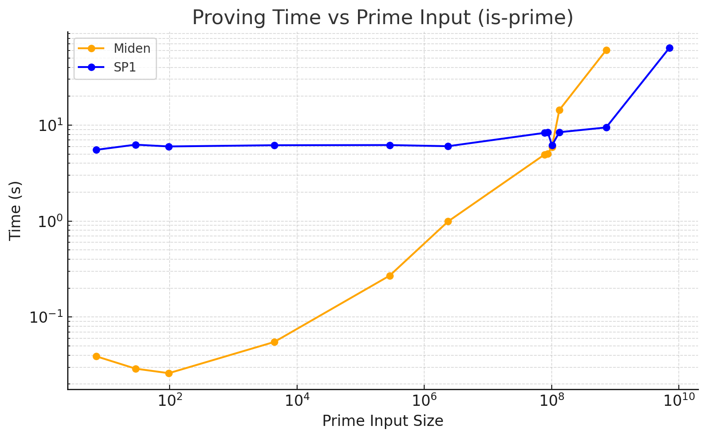
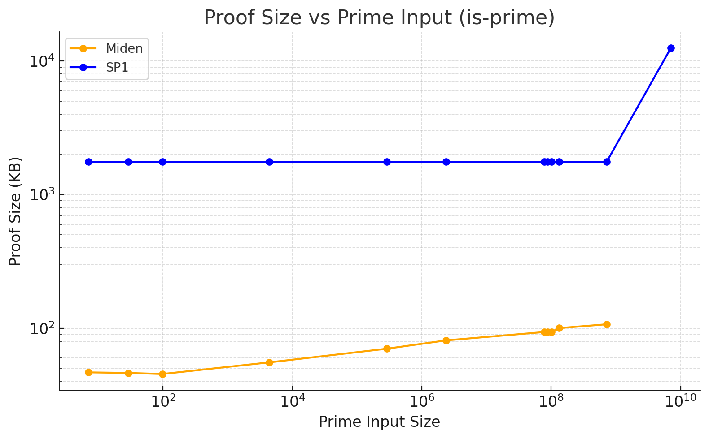
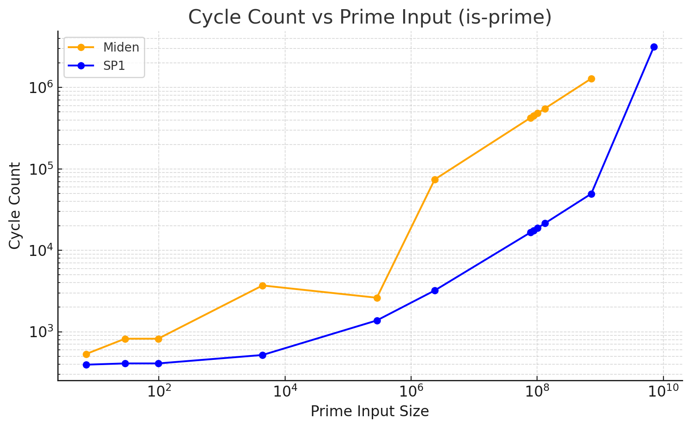
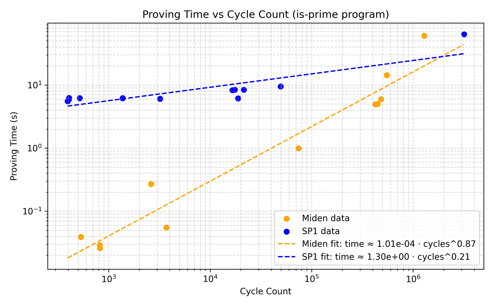

# `is-prime` Miden vs SP1 zkVM Benchmark

### About

This repository provides a concise, reproducible benchmark that measures the execution time of an identical **primality‑checking** program on two zero‑knowledge virtual machines (zkVMs): **Miden** and **SP1**.

### Benchmark Setup

The `is-prime` benchmark was conducted on an **Apple M2 Pro** processor. For each test case, we passed a prime number to the `is-prime` program running inside each VM. The table below lists all inputs and the corresponding benchmark results for each zkVM.

### Inputs

| Prime Input | Miden (ms) | SP1 (ms) | Miden Proof Size (bytes) | SP1 Proof Size (bytes) | Miden Cycle Count | SP1 Cycle Count |
|-------------|-----------:|---------:|-------------------------:|-----------------------:|------------------:|----------------:|
| 7           | 39         | 5524     | 47 887                   | 1 799 786              | 533               | 394             |
| 29          | 29         | 6252     | 47 432                   | 1 799 786              | 821               | 408             |
| 97          | 26         | 5993     | 46 544                   | 1 799 786              | 821               | 408             |
| 4 397       | 55         | 6171     | 56 908                   | 1 799 786              | 3 701             | 518             |
| 285 191     | 270        | 6196     | 71 983                   | 1 799 786              | 2 616             | 1 376           |
| 2 364 361   | 992        | 6027     | 83 106                   | 1 799 786              | 74 261            | 3 213           |
| 77 557 187  | 4941       | 8305     | 95 981                   | 1 799 786              | 423 029           | 16 534          |
| 87 019 979  | 5027       | 8431     | 96 014                   | 1 799 786              | 448 085           | 17 491          |
| 101 146 501 | 5938       | 6136     | 96 382                   | 1 799 786              | 483 221           | 18 833          |
| 131 807 699 | 14 353     | 8431     | 102 678                  | 1 799 786              | 551 477           | 21 440          |
| 718 064 159 | 60 420     | 9452     | 109 680                  | 1 799 786              | 1 286 741         | 49 523          |
| 7 069 067 389 | —         | 63 827   | —                        | 12 814 889             | —                 | 3 165 901       |


### Results






The same Rust `is_prime` function is used in both benchmarks:

```rust
fn is_prime(n: u32) -> bool {
    if n <= 1 {
        return false;
    }
    if n <= 3 {
        return true;
    }
    if n % 2 == 0 || n % 3 == 0 {
        return false;
    }
    let mut i = 5;
    while i * i <= n {
        if n % i == 0 || n % (i + 2) == 0 {
            return false;
        }
        i += 6;
    }
    true
}
```

### Running `is-prime‑miden`

```bash
cd is-prime-miden
./install_script.sh
./run_benchmark.sh
```

### Running `is-prime‑sp1`

```bash
cd is-prime-sp1
./run_benchmark.sh
```

