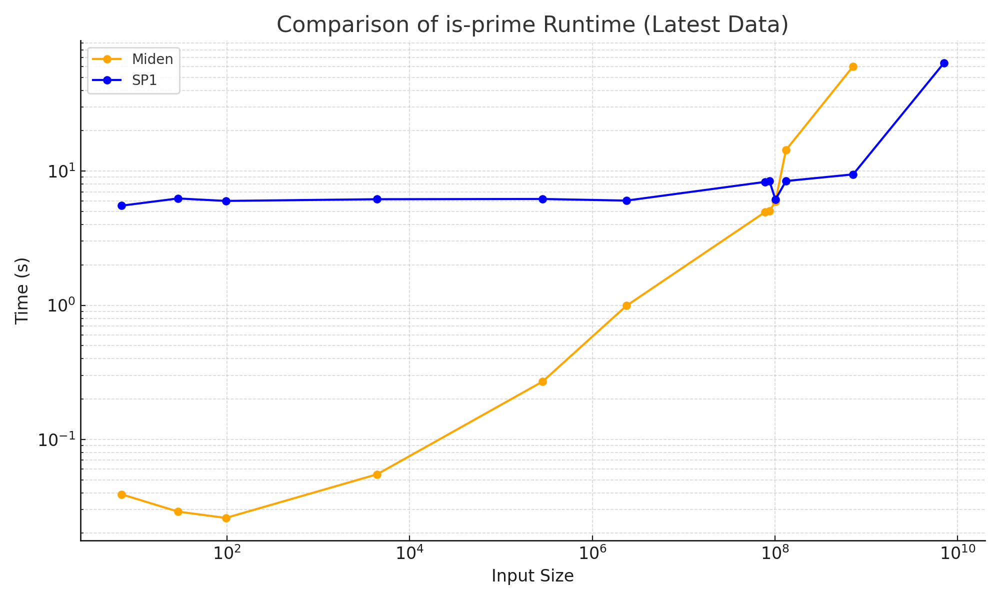

# `is-prime` Miden vs SP1 ZK-VM Benchmark

### About


This repository provides a concise, reproducible benchmark that measures the execution time of an identical **primality-checking** program on two zero-knowledge virtual machines (zkVMs): **Miden** and **SP1**. 

### Benchmark Setup

The `is-prime` benchmark was conducted on an **Apple M2 Pro** processor. The current `is-prime` implementation for **Miden** is generated automatically by the Miden Rust compiler and has not yet undergone optimization. Consequently, the reported Miden runtimes represent baseline, unoptimized performance. Hand-written MASM (Miden Assembly) implementation would most likely yield considerably faster execution.

### Results:


| Input      | Miden (ms) | SP1 (ms)  |
|------------|------------|-----------|
| 7          | 39         | 5524      |
| 29         | 29         | 6252      |
| 97         | 26         | 5993      |
| 4397       | 55         | 6171      |
| 285191     | 270        | 6196      |
| 2364361    | 992        | 6027      |
| 77557187   | 4941       | 8305      |
| 87019979   | 5027       | 8431      |
| 101146501  | 5938       | 6136      |
| 131807699  | 14353      | 8431      |
| 718064159  | 60420      | 9452      |
| 7069067389 | -         | 63827      |


The same Rust `is_prime` function is used in both benchmarks:

```rs
fn is_prime(n: u32) -> bool {
    if n <= 1 {
        return false;
    }
    if n <= 3 {
        return true;
    }
    if n % 2 == 0 || n % 3 == 0 {
        return false;
    }
    let mut i = 5;
    while i * i <= n {
        if n % i == 0 || n % (i + 2) == 0 {
            return false;
        }
        i += 6;
    }
    true
}
```


### Running `is-prime-miden`

```
cd is-prime-miden
bash ./install_script.sh
bash ./run_benchmark.sh
```

### Running `is-prime-sp1`

```
cd ../script
RUST_LOG=info cargo run --release -- --execute
```
